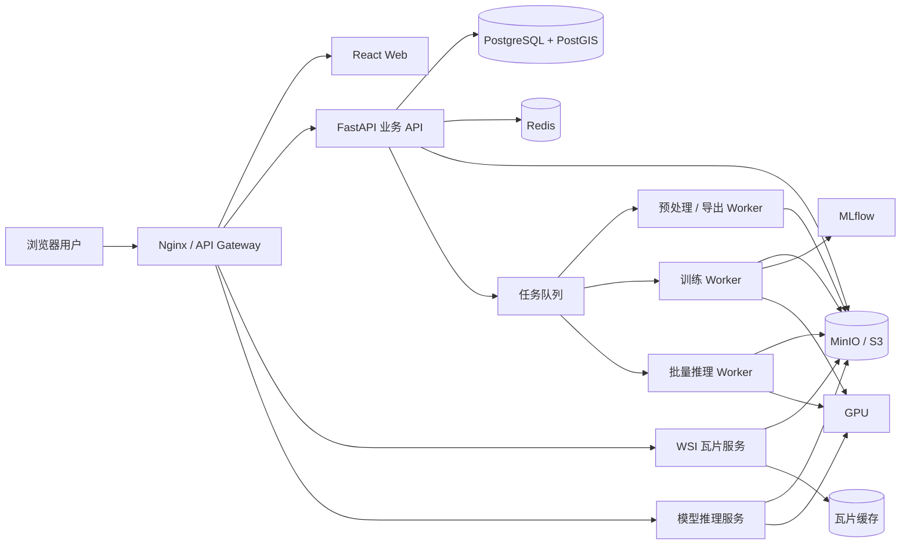
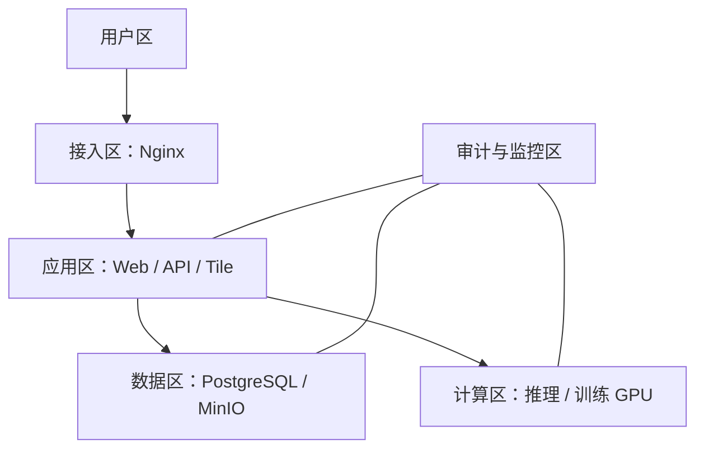
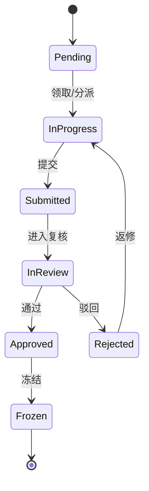
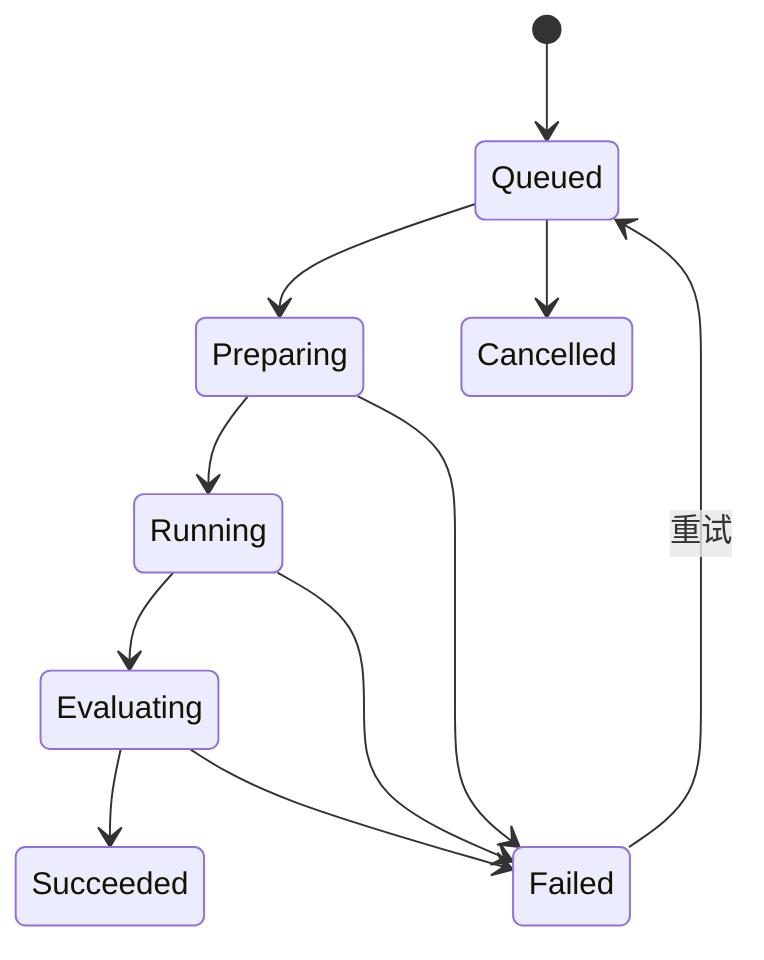
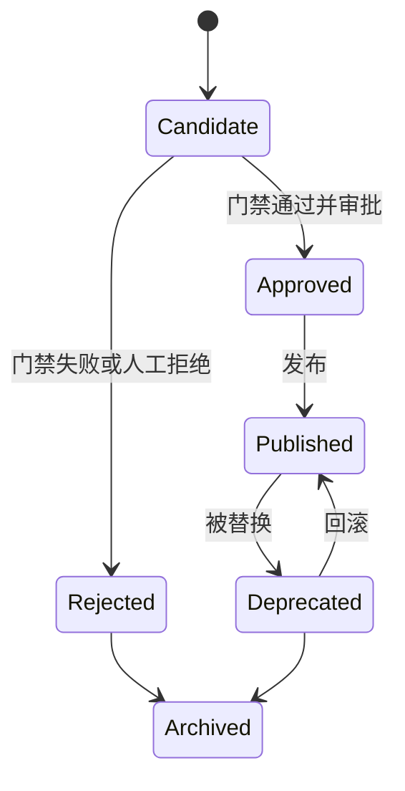
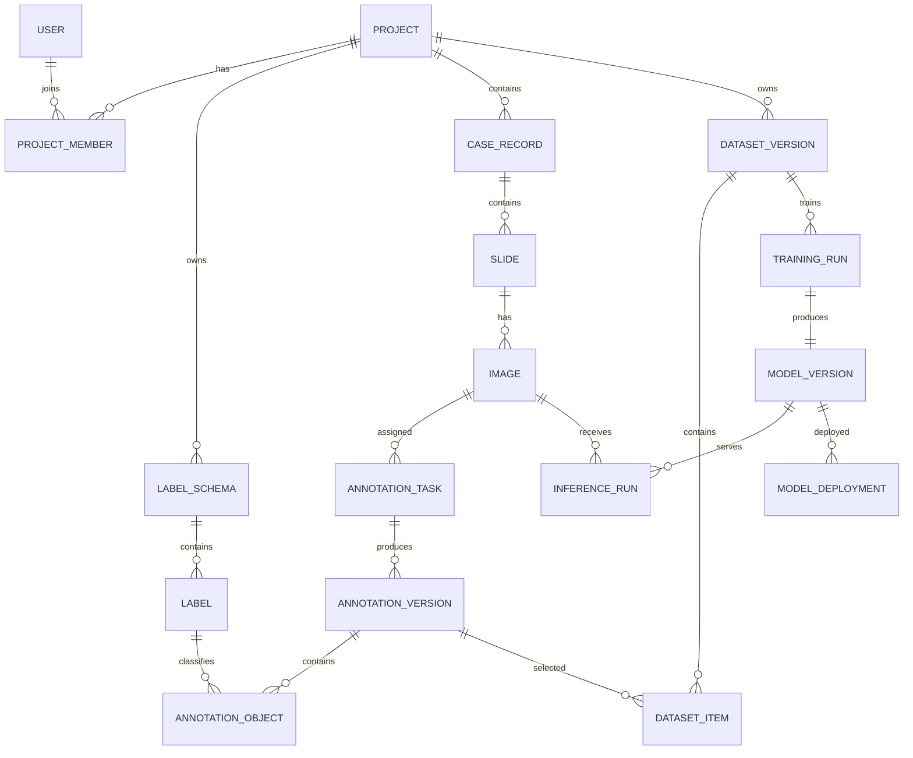
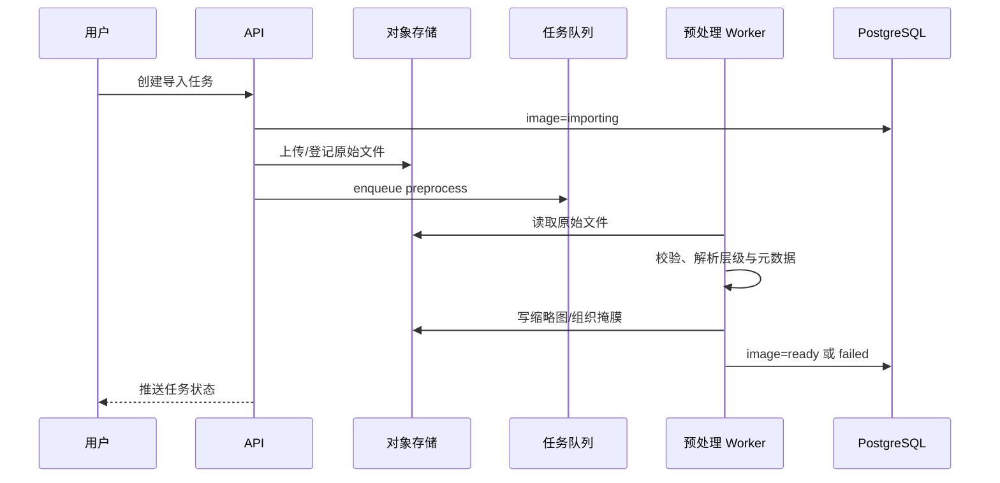
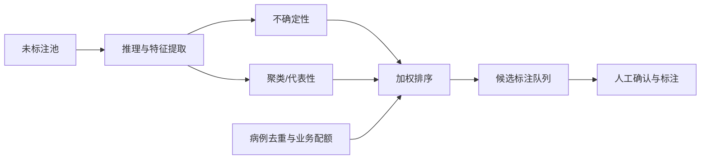
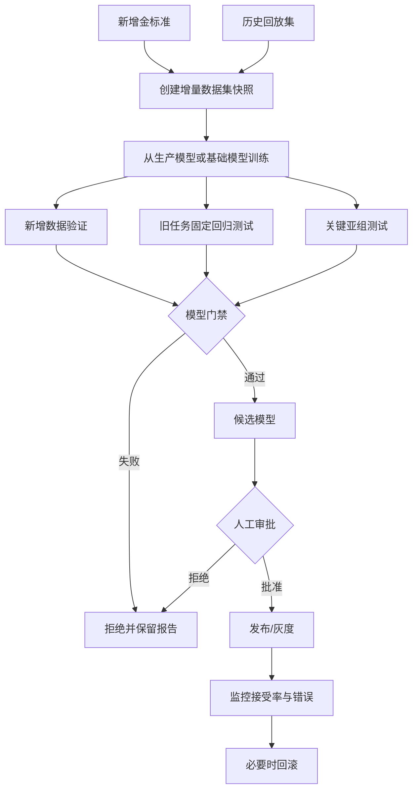

# PathFISA 系统设计

## 1. 设计概述

### 1.1 设计原则

1. **人机协同优先**：模型给出建议，人工对金标准和模型发布负责。
2. **受控增量学习**：训练可自动化，发布不可静默自动化。
3. **数据不可变、结果可追溯**：提交后的标注、数据集和模型均版本化。
4. **WSI 原生设计**：围绕金字塔瓦片、超大坐标和局部计算设计。
5. **模块化单体起步**：MVP 减少运维复杂度，但保留拆分服务边界。
6. **异步重任务**：切片预处理、推理、训练和导出均通过任务队列执行。
7. **模型失败不阻塞标注**：AI 是增强能力，不是标注主流程的单点依赖。

### 1.2 推荐技术栈

| 层级 | 推荐方案 | 说明 |
| --- | --- | --- |
| Web 前端 | React + TypeScript + Vite | 组件生态成熟，适合复杂交互 |
| UI | Ant Design | 快速构建后台与任务页面 |
| WSI 浏览 | OpenSeadragon | 多分辨率切片浏览 |
| 图形标注 | Canvas/WebGL 覆盖层，结合 Konva/Fabric 或自研几何层 | 支持大量对象与交互 |
| 状态管理 | Zustand + TanStack Query | 本地交互状态与服务端状态分离 |
| 后端 API | Python FastAPI | 易与病理图像及模型生态集成 |
| ORM/迁移 | SQLAlchemy + Alembic | 数据模型与迁移管理 |
| 主数据库 | PostgreSQL + PostGIS | 事务、JSONB、空间索引 |
| 对象存储 | MinIO/S3 | WSI、缩略图、模型和导出文件 |
| 缓存/队列 | Redis | 缓存、锁和任务中间件 |
| 异步任务 | Celery | 预处理、推理、训练、导出 |
| WSI 解析 | OpenSlide，必要时增加 tifffile/pyvips/厂商 SDK | 多格式适配 |
| 训练框架 | PyTorch + MONAI/tiatoolbox | 医学图像与病理训练 |
| 实验跟踪 | MLflow | 参数、指标和模型产物追踪 |
| 容器与部署 | Docker Compose；后续 Kubernetes | 私有化部署和水平扩展 |
| 监控 | Prometheus + Grafana + Loki/OpenTelemetry | 指标、日志和链路追踪 |

MVP 推荐采用“模块化单体 API + 独立 Worker + 独立模型服务”。当并发量或团队规模增加后，再拆分数据、标注、任务和模型管理服务。

## 2. 总体架构



### 2.1 逻辑模块

| 模块 | 职责 |
| --- | --- |
| 身份与权限 | 登录、令牌、角色、项目成员、数据范围 |
| 项目管理 | 项目、标签体系、工作流、门禁配置 |
| 样本管理 | 病例、切片、图像、元数据、导入与质控 |
| WSI 服务 | 元数据解析、缩略图、Deep Zoom/IIIF 风格瓦片 |
| 标注服务 | 草稿、几何对象、版本、提交、差异和空间查询 |
| 任务与复核 | 分派、领取、状态机、评论、复核和仲裁 |
| 推理服务 | 模型加载、ROI 推理、整片批量推理和热力图 |
| 数据集服务 | 查询、冻结、快照、划分和数据血缘 |
| 训练服务 | 配置、调度、日志、产物和失败恢复 |
| 主动学习 | 特征、不确定性、聚类、候选排序 |
| 模型注册表 | 模型版本、指标、审批、发布和回滚 |
| 导入导出 | GeoJSON、COCO、掩膜、CSV 及适配器 |
| 审计与统计 | 操作日志、工作量、质量和模型效益指标 |

## 3. 部署架构

### 3.1 MVP 单机/工作站部署

适合研发验证：

```text
一台 Linux GPU 服务器
├── Nginx
├── Web
├── API
├── Tile Service
├── Celery Worker
├── Inference/Training Worker
├── PostgreSQL + PostGIS
├── Redis
├── MinIO
└── MLflow
```

### 3.2 机构级部署

- Web/API 节点可水平扩展。
- PostgreSQL 使用主从、定期备份和时间点恢复。
- MinIO 使用纠删码或对接已有对象存储。
- 瓦片服务部署本地 SSD 缓存。
- 推理 Worker 与训练 Worker 使用不同 GPU 队列，避免训练抢占在线推理资源。
- 外部访问通过反向代理、TLS、机构身份服务和网络访问控制。

### 3.3 网络区域建议



## 4. 前端设计

### 4.1 页面结构

```text
/login
/dashboard
/projects
/projects/:projectId/overview
/projects/:projectId/samples
/projects/:projectId/tasks
/projects/:projectId/annotate/:imageId
/projects/:projectId/reviews
/projects/:projectId/datasets
/projects/:projectId/training
/projects/:projectId/models
/projects/:projectId/active-learning
/projects/:projectId/settings
/admin/users
/admin/audit
```

### 4.2 标注工作台布局

```text
┌──────────────────────────────────────────────────────────────┐
│ 样本信息 | 当前倍率 | 模型版本 | 保存状态 | 提交/复核          │
├────────────┬───────────────────────────────────┬─────────────┤
│ 图形工具栏  │                                   │ 标签/对象树   │
│ 选择/点/框  │           WSI 主视图              │ 属性/置信度   │
│ 多边形/笔刷 │        AI 热力图与标注叠加          │ 质控问题      │
│ AI 提示工具 │                                   │ 评论/历史     │
├────────────┴───────────────────────────────────┴─────────────┤
│ 缩略导航 | 状态提示 | 快捷键 | 坐标 | 比例尺 | 推理任务进度       │
└──────────────────────────────────────────────────────────────┘
```

### 4.3 前端状态划分

- **服务端状态**：项目、样本、任务、标注版本、模型和队列，使用 TanStack Query。
- **编辑器状态**：当前工具、选择对象、临时几何、撤销栈和视口，使用 Zustand。
- **草稿状态**：采用本地内存 + 服务端增量草稿；IndexedDB 作为断网保护。
- **任务进度**：通过 WebSocket 或 Server-Sent Events 接收。

### 4.4 大规模标注渲染

- 只查询当前视野边界相交的标注。
- PostGIS 使用包围盒空间索引。
- 低倍率下返回简化轮廓或聚合结果。
- 高倍率下返回完整几何。
- 对超大掩膜使用分块 RLE/二值瓦片，不将数百万顶点作为单个 JSON 返回。
- 编辑中的对象使用 Canvas/WebGL 渲染；对象树使用虚拟列表。

## 5. 后端服务设计

### 5.1 模块化目录建议

```text
PathFISA/
├── apps/
│   ├── web/
│   ├── api/
│   ├── tile-service/
│   └── model-service/
├── workers/
│   ├── preprocessing/
│   ├── inference/
│   ├── training/
│   └── export/
├── packages/
│   ├── annotation-schema/
│   ├── pathology-io/
│   ├── model-sdk/
│   └── shared-types/
├── ml/
│   ├── configs/
│   ├── datasets/
│   ├── models/
│   ├── pipelines/
│   └── evaluation/
├── deploy/
│   ├── docker/
│   └── compose/
├── docs/
└── tests/
```

### 5.2 API 分层

```text
Router/API
  -> Application Service（用例、事务、权限）
    -> Domain（实体、状态机、规则）
      -> Repository / Adapter
        -> PostgreSQL、MinIO、Redis、MLflow、模型服务
```

业务规则不得散落在路由函数或前端。例如“只有已复核标注才能进入训练集”和“未过门禁不能发布”必须由后端领域服务强制执行。

### 5.3 任务状态机

#### 标注任务



#### 训练任务



#### 模型版本



## 6. 数据模型

### 6.1 核心实体关系



### 6.2 主要表

#### 用户与项目

- `users`
- `roles`
- `user_roles`
- `projects`
- `project_members`
- `project_settings`

#### 样本

- `cases`
- `slides`
- `images`
- `image_files`
- `image_metadata`
- `image_quality_checks`

#### 标签与标注

- `label_schemas`
- `labels`
- `annotation_tasks`
- `annotation_drafts`
- `annotation_versions`
- `annotation_objects`
- `annotation_comments`
- `review_records`

#### 数据与模型

- `dataset_versions`
- `dataset_items`
- `dataset_splits`
- `training_runs`
- `training_artifacts`
- `model_versions`
- `model_metrics`
- `model_approvals`
- `model_deployments`
- `inference_runs`
- `active_learning_batches`
- `active_learning_items`

#### 平台

- `async_jobs`
- `audit_logs`
- `export_jobs`
- `notifications`

### 6.3 关键字段示例

#### `images`

| 字段 | 类型 | 说明 |
| --- | --- | --- |
| id | UUID | 主键 |
| slide_id | UUID | 所属切片 |
| storage_uri | text | 对象存储位置 |
| checksum | text | 文件校验值 |
| format | varchar | SVS/NDPI/TIFF 等 |
| width/height | bigint | 第 0 层尺寸 |
| level_count | int | 金字塔层数 |
| mpp_x/mpp_y | decimal | 微米/像素 |
| objective_power | decimal | 标称倍率 |
| status | enum | importing/ready/failed/archived |
| metadata | jsonb | 扩展元数据 |

#### `annotation_versions`

| 字段 | 类型 | 说明 |
| --- | --- | --- |
| id | UUID | 版本 ID |
| task_id | UUID | 标注任务 |
| version_no | int | 任务内递增版本 |
| parent_version_id | UUID | 父版本 |
| label_schema_version | varchar | 标签体系版本 |
| status | enum | submitted/approved/rejected/frozen |
| author_id | UUID | 提交者 |
| source_model_id | UUID | 可选，预标注来源 |
| object_count | int | 对象数 |
| snapshot_uri | text | 完整快照位置 |
| checksum | text | 快照校验值 |
| created_at | timestamptz | 创建时间 |

#### `annotation_objects`

| 字段 | 类型 | 说明 |
| --- | --- | --- |
| id | UUID | 稳定对象 ID |
| annotation_version_id | UUID | 所属版本 |
| label_id | UUID | 标签 |
| geometry_type | enum | point/box/polygon/polyline/mask |
| geometry | geometry | PostGIS 几何，WSI 第 0 层坐标 |
| bbox | box2d | 快速视野过滤 |
| properties | jsonb | 业务属性 |
| provenance | enum | manual/model/model_accepted/model_corrected/imported |
| confidence | real | 模型置信度，可空 |
| source_model_id | UUID | 来源模型，可空 |
| is_deleted | boolean | 版本差异需要时使用 |

对于像素级大掩膜，`geometry` 只保存包围盒或简化轮廓，真实掩膜以分块 RLE/PNG 瓦片存储在对象存储中。

#### `model_versions`

| 字段 | 类型 | 说明 |
| --- | --- | --- |
| id | UUID | 模型版本 ID |
| project_id | UUID | 项目 |
| name/version | varchar | 名称与语义版本 |
| parent_model_id | UUID | 父模型 |
| training_run_id | UUID | 训练任务 |
| dataset_version_id | UUID | 数据集 |
| artifact_uri | text | 模型产物 |
| artifact_checksum | text | 校验值 |
| task_type | enum | classification/detection/segmentation |
| status | enum | candidate/approved/published/deprecated/archived |
| runtime_spec | jsonb | 输入、输出、框架、设备等 |
| created_at | timestamptz | 创建时间 |

### 6.4 坐标与几何约定

- 所有矢量几何保存为 WSI 第 0 层像素坐标。
- 矩形使用 `[x, y, width, height]`，转换为 PostGIS polygon 索引。
- 点坐标允许浮点数，导出时按目标格式处理。
- 前端通过当前层级缩放因子转换显示坐标，不改写存储坐标。
- 几何对象必须位于 `[0,width) × [0,height)` 范围内。
- 多边形使用明确的外环/内环方向约定，并在服务端修复或拒绝非法几何。
- 涉及物理尺度的计算必须使用 `mpp_x/mpp_y`，缺失时提示不可进行精确测量。

## 7. 对象存储设计

```text
s3://pathfisa/
├── raw/{project_id}/{image_id}/source.ext
├── derived/{image_id}/thumbnail.jpg
├── derived/{image_id}/tissue-mask/
├── tiles-cache/{image_id}/{level}/{x}_{y}.jpg
├── annotations/{task_id}/{version}.json.gz
├── masks/{annotation_version_id}/{object_id}/...
├── datasets/{dataset_version_id}/manifest.json
├── runs/{training_run_id}/
│   ├── config.yaml
│   ├── logs/
│   ├── checkpoints/
│   └── report.json
├── models/{model_version_id}/
└── exports/{export_job_id}/...
```

原始文件桶应启用只读策略或对象锁定策略；派生数据可重建，但也需记录生成器版本。

## 8. API 设计

API 使用 `/api/v1` 版本前缀。列表接口统一使用游标或分页，长任务统一返回 `job_id`。

### 8.1 项目与样本

```http
POST   /api/v1/projects
GET    /api/v1/projects/{project_id}
POST   /api/v1/projects/{project_id}/images/import
GET    /api/v1/projects/{project_id}/images
GET    /api/v1/images/{image_id}
GET    /api/v1/images/{image_id}/metadata
GET    /api/v1/images/{image_id}/thumbnail
GET    /api/v1/images/{image_id}/tiles/{level}/{x}/{y}
```

### 8.2 标注

```http
POST   /api/v1/annotation-tasks
POST   /api/v1/annotation-tasks/{task_id}/claim
GET    /api/v1/annotation-tasks/{task_id}
GET    /api/v1/annotation-tasks/{task_id}/draft
PUT    /api/v1/annotation-tasks/{task_id}/draft
POST   /api/v1/annotation-tasks/{task_id}/submit
GET    /api/v1/annotation-versions/{version_id}
GET    /api/v1/annotation-versions/{version_id}/objects?bbox=x1,y1,x2,y2
GET    /api/v1/annotation-versions/{a}/diff/{b}
POST   /api/v1/annotation-versions/{version_id}/review
POST   /api/v1/annotation-versions/{version_id}/freeze
```

草稿更新使用乐观锁：

```json
{
  "base_revision": 27,
  "operations": [
    {
      "op": "upsert",
      "object": {
        "id": "uuid",
        "label_id": "uuid",
        "geometry_type": "polygon",
        "coordinates": []
      }
    }
  ]
}
```

服务器返回新的 `revision`。版本冲突时返回 `409 Conflict`，前端提示合并或重新加载，防止多人覆盖。

### 8.3 推理

```http
POST   /api/v1/inference/roi
POST   /api/v1/inference/whole-slide
GET    /api/v1/inference-runs/{run_id}
GET    /api/v1/inference-runs/{run_id}/results?bbox=...
POST   /api/v1/inference-runs/{run_id}/cancel
```

ROI 交互推理可同步等待短时结果；整片推理必须异步。请求中必须明确 `model_version_id`，不能隐式使用“最新模型”而不记录版本。

### 8.4 数据集、训练和模型

```http
POST   /api/v1/datasets
POST   /api/v1/datasets/{dataset_id}/versions
GET    /api/v1/dataset-versions/{version_id}/manifest
POST   /api/v1/training-runs
GET    /api/v1/training-runs/{run_id}
POST   /api/v1/training-runs/{run_id}/cancel
GET    /api/v1/models
GET    /api/v1/models/{model_version_id}
POST   /api/v1/models/{model_version_id}/evaluate
POST   /api/v1/models/{model_version_id}/approve
POST   /api/v1/models/{model_version_id}/publish
POST   /api/v1/models/{model_version_id}/rollback
```

### 8.5 主动学习

```http
POST   /api/v1/active-learning/batches
GET    /api/v1/active-learning/batches/{batch_id}
GET    /api/v1/active-learning/batches/{batch_id}/items
POST   /api/v1/active-learning/batches/{batch_id}/finalize
```

### 8.6 错误格式

```json
{
  "error": {
    "code": "ANNOTATION_REVISION_CONFLICT",
    "message": "草稿已被其他会话更新",
    "details": {
      "expected_revision": 27,
      "actual_revision": 29
    },
    "trace_id": "..."
  }
}
```

## 9. WSI 处理设计

### 9.1 导入流程



### 9.2 瓦片策略

- 对原生金字塔 WSI 直接按层级读取。
- 对非金字塔图像可异步转换为 OME-TIFF 或预生成瓦片。
- 瓦片尺寸建议 256 或 512 像素，JPEG 质量按病理专家验证后配置。
- 缓存键必须包含图像校验值、层级、坐标、色彩参数版本。
- 不将用户显示层面的亮度/对比度调整写回原图。
- 瓦片服务限制单用户请求速率，防止错误脚本拖垮 I/O。

### 9.3 组织区域检测

导入后可生成低分辨率组织掩膜，用于：

- 跳过空白背景；
- 训练 Patch 采样；
- 整片推理范围约束；
- 计算组织覆盖率；
- 主动学习候选生成。

组织掩膜属于可重建派生数据，应记录算法和参数版本。

## 10. 智能标注与推理设计

### 10.1 模型统一接口

每个可部署模型应提供：

```python
class PathFISAModel:
    def metadata(self) -> dict: ...
    def preprocess(self, image, context) -> object: ...
    def predict(self, batch, prompts=None) -> object: ...
    def postprocess(self, output, context) -> list[dict]: ...
```

模型元数据至少包含：

- 任务类型；
- 输入尺寸和倍率/MPP；
- 归一化参数；
- 标签体系版本和标签映射；
- 输出几何格式；
- 推荐阈值；
- 运行时与显存需求；
- 模型文件校验值。

### 10.2 ROI 推理

1. 前端提交 WSI 坐标范围、目标倍率、模型版本和提示点/框。
2. 服务端从 WSI 读取相应区域。
3. 按模型要求缩放、归一化并推理。
4. 将局部输出转换回第 0 层坐标。
5. 返回临时预标注对象。
6. 用户接受后才写入草稿，并保留来源模型。

### 10.3 整片推理

1. 根据组织掩膜生成 Patch 网格。
2. 批量读取、预处理和 GPU 推理。
3. 按任务进行滑窗融合、非极大值抑制或对象合并。
4. 生成热力图和矢量/掩膜结果。
5. 写入 `inference_run`，不直接写入金标准标注。
6. 标注工作台按视野加载结果。

### 10.4 模型加载

- 在线推理服务维护有限大小的模型 LRU 缓存。
- 发布事件触发预热，但已有请求继续使用原模型版本。
- 每次请求固定到明确版本，避免请求中途切换。
- 模型加载失败自动熔断并回报，不影响人工标注页面。

## 11. 小样本训练设计

### 11.1 训练数据管线


### 11.2 冷启动训练模板

MVP 建议内置两种模板：

1. **Patch 分类模板**
   - 病理预训练编码器；
   - 冻结骨干起步；
   - 类别加权或 focal loss；
   - 病例级指标聚合。

2. **区域分割模板**
   - 预训练编码器 + U-Net 类解码器，或可提示分割模型适配；
   - 正负 Patch 平衡采样；
   - Dice + BCE/Focal 组合损失；
   - 大图滑窗推理与重叠融合。

检测任务可在后续增加，或在首个业务目标明确为细胞/目标检测时替换分类模板。

### 11.3 数据泄漏控制

- 同一病例的所有切片和 Patch 只能出现在一个数据集合中。
- 数据集快照记录病例 ID 列表和划分算法。
- 归一化统计量只能从训练集计算。
- 主动学习候选池不得包含固定测试集。
- 测试集冻结后，普通项目成员不得查看单样本预测以反复调参。

### 11.4 实验可复现

训练任务生成：

```text
run manifest
├── git_commit
├── container_image_digest
├── dataset_version_id
├── label_schema_version
├── parent_model_id
├── config
├── random_seed
├── hardware
├── dependency_versions
├── metrics
└── artifact_checksums
```

## 12. 主动学习设计

### 12.1 候选粒度

- 图像级：适合整片分类或病例筛选。
- ROI/Patch 级：适合局灶性病变、细胞和区域标注。
- 对象级：适合复核低置信检测或分割边界。

### 12.2 评分组成

1. **不确定性**
   - 分类熵；
   - 最大概率的反值；
   - 多次增强/集成预测方差；
   - 分割边界不确定性。

2. **代表性**
   - 候选特征到未标注数据密集区域中心的接近程度。

3. **多样性**
   - k-center、聚类后分层采样或最远点采样。

4. **业务约束**
   - 病种、中心、扫描仪、染色批次配额；
   - 每病例最大数量；
   - 专家指定优先级。

### 12.3 生成流程



候选批次一旦确认，应保存算法版本、模型版本、候选池快照、权重和最终顺序，以便比较主动学习策略收益。

## 13. 增量学习设计

### 13.1 增量类型

| 类型 | 含义 | 主要风险 |
| --- | --- | --- |
| 数据增量 | 同一标签体系新增样本 | 分布漂移、过拟合新批次 |
| 类别增量 | 新增标签类别 | 旧类别遗忘、标签空间变化 |
| 域增量 | 新中心/扫描仪/染色域 | 域偏差和校准失效 |

MVP 优先完整支持数据增量；类别增量和域增量提供显式实验标识与基础流程，不宣称自动解决。

### 13.2 回放集

回放集不是简单随机抽取，应覆盖：

- 各历史类别；
- 不同中心、扫描仪、染色批次；
- 典型样本和历史难例；
- 当前生产模型易错样本；
- 关键临床亚组。

回放集作为数据集版本的一部分被冻结。可采用“每类固定配额 + 特征聚类中心 + 难例配额”的组合策略。

### 13.3 增量训练流程



### 13.4 发布门禁

门禁规则项目化配置，示例：

```yaml
gates:
  - metric: new_test.dice
    op: ">="
    value: 0.80
  - metric: old_test.dice_delta
    op: ">="
    value: -0.02
  - metric: old_test.sensitivity_delta
    op: ">="
    value: -0.01
  - metric: subgroup.min_dice
    op: ">="
    value: 0.72
  - metric: inference.latency_p95_ms
    op: "<="
    value: 1500
```

示例数值仅用于展示配置方式，实际阈值必须由具体任务负责人确认。

### 13.5 灰度与回滚

- 部署记录将项目、任务、用户组映射到确定模型版本。
- 灰度阶段可只对指定项目成员开放。
- 线上监控包括请求失败、延迟、预标注接受率、修改率和删除率。
- 回滚只改变部署指针，不删除新模型及其审计记录。
- 已生成的推理结果继续保留原始模型版本，不随回滚重写。

## 14. 数据集版本设计

数据集版本采用不可变清单：

```json
{
  "dataset_version": "ds-v12",
  "project_id": "uuid",
  "label_schema_version": "3.0",
  "created_at": "2026-06-23T00:00:00Z",
  "split_unit": "case",
  "items": [
    {
      "case_id": "uuid",
      "image_id": "uuid",
      "annotation_version_id": "uuid",
      "split": "train",
      "role": "new"
    },
    {
      "case_id": "uuid",
      "image_id": "uuid",
      "annotation_version_id": "uuid",
      "split": "train",
      "role": "replay"
    }
  ],
  "checksum": "sha256:..."
}
```

一旦有训练任务引用，数据集版本不可修改。需要变更时创建新版本。

## 15. 安全设计

### 15.1 身份与会话

- 短期访问令牌 + 可撤销刷新令牌。
- 支持机构 OIDC/LDAP 接入。
- 管理员、导出、删除和模型发布可要求二次认证。
- 限制登录失败次数并记录异常登录。

### 15.2 授权

后端每次请求校验：

```text
用户全局角色
AND 项目成员关系
AND 资源所属项目
AND 数据范围
AND 当前对象状态允许的操作
```

对象存储文件不直接公开；通过短期签名 URL 或后端代理访问。

### 15.3 隐私

- 病例表仅保存项目需要的最小字段。
- 直接身份信息与研究编号分离存放。
- 日志避免写入身份字段、令牌和图像内容。
- 导出任务生成字段清单和审批记录。
- 删除采用业务归档和受控物理清理流程，避免破坏模型血缘。

### 15.4 审计

审计事件至少包含：

```json
{
  "event_id": "uuid",
  "actor_id": "uuid",
  "action": "model.publish",
  "resource_type": "model_version",
  "resource_id": "uuid",
  "project_id": "uuid",
  "before": {},
  "after": {},
  "ip": "...",
  "user_agent": "...",
  "trace_id": "...",
  "created_at": "..."
}
```

高价值审计日志可追加写入独立存储，并定期校验完整性。

## 16. 性能与可靠性设计

### 16.1 缓存

| 内容 | 缓存位置 | 失效策略 |
| --- | --- | --- |
| WSI 元数据 | Redis/API 本地 | 图像版本变化 |
| 热门瓦片 | 本地 SSD/反向代理 | 基于校验值长期缓存 |
| 模型文件 | 推理节点本地 | 模型版本变化 |
| 当前项目配置 | Redis | 配置版本变化 |
| 当前视野标注 | 浏览器查询缓存 | 草稿 revision 变化 |

### 16.2 幂等性

- 导入、提交、训练创建、发布和导出接口支持 `Idempotency-Key`。
- Worker 任务重复执行不得生成冲突状态。
- 对象存储写入先使用临时键，完成后原子登记。
- 模型发布通过数据库事务和部署锁保证单项目单任务只有一个当前版本。

### 16.3 备份

- PostgreSQL：每日全量 + 持续 WAL/等效增量备份。
- 对象存储：版本化或跨设备复制。
- 模型、数据集清单和审计日志纳入重点恢复演练。
- 定期执行恢复测试，不能只验证备份任务“成功”。

### 16.4 降级

- 模型服务故障：隐藏/禁用 AI 操作，保留人工标注。
- Redis 短时故障：阻止新异步任务提交，已保存业务数据不丢失。
- 瓦片缓存故障：回源读取 WSI。
- 统计服务故障：不影响核心标注流程。

## 17. 可观测性

### 17.1 技术指标

- API QPS、P50/P95/P99 延迟、错误率；
- 瓦片命中率、读取延迟和 I/O 吞吐；
- 队列长度、等待时间、失败率和重试次数；
- GPU 利用率、显存、推理批次和延迟；
- PostgreSQL 慢查询、连接数和锁等待；
- 对象存储容量、请求错误和增长速率。

### 17.2 业务指标

- 样本导入成功率；
- 每人每天完成任务数；
- 首次复核通过率；
- 标注平均耗时和编辑操作数；
- AI 直接接受率、修改率和拒绝率；
- 模型版本使用量；
- 主动学习样本的有效新增信息量；
- 增量模型门禁通过率和回滚次数。

所有请求、异步任务、训练和推理应使用统一 `trace_id` 串联。

## 18. 测试策略

### 18.1 单元测试

- 权限与状态机；
- 坐标变换和几何校验；
- 标签映射；
- 数据集划分与病例隔离；
- 模型门禁规则；
- 主动学习评分；
- 格式适配器。

### 18.2 集成测试

- WSI 导入、解析、瓦片和缩略图；
- 标注草稿并发冲突；
- 提交—复核—冻结；
- 数据集快照—训练—评估—发布；
- MinIO、PostgreSQL、Redis 和 MLflow 集成；
- 模型服务异常时的降级。

### 18.3 端到端测试

覆盖：

1. 创建项目和标签；
2. 导入 WSI；
3. 人工标注并自动保存；
4. AI ROI 预标注与修订；
5. 提交和复核；
6. 创建数据集版本；
7. 发起增量训练；
8. 门禁通过后发布；
9. 使用新模型推理；
10. 回滚并验证部署版本。

### 18.4 算法测试

- 固定随机种子后的最低可复现范围；
- 病例级泄漏自动检测；
- 小样本重复实验及均值/波动；
- 旧任务回归；
- 不同中心、扫描仪和染色批次亚组；
- 无组织、模糊、折叠、气泡等异常切片；
- 极大 WSI 和超大标注对象压力测试。

## 19. 开发阶段建议

### 阶段 0：业务样例与技术验证（2–3 周）

- 确认首个病种、任务和标注规范。
- 用真实脱敏 WSI 验证 OpenSlide/格式兼容性。
- 完成 WSI 浏览、坐标绘制和模型 ROI 推理技术原型。
- 确定基线数据和验收指标。

### 阶段 1：标注平台 MVP（5–7 周）

- 用户、项目、样本导入。
- WSI 瓦片浏览。
- 标签体系、标注工具、草稿、提交和复核。
- GeoJSON/COCO/掩膜导出。
- 审计与基础统计。

### 阶段 2：智能辅助与小样本训练（4–6 周）

- ROI/整片预标注。
- 训练模板、数据集版本和 MLflow。
- 模型评估、注册、发布和回滚。
- AI 使用效果统计。

### 阶段 3：主动学习与增量闭环（4–6 周）

- 候选池、特征与不确定性评分。
- 回放集管理。
- 增量训练与旧任务回归门禁。
- 灰度发布与线上效益监控。

### 阶段 4：机构化增强

- 双人复核和仲裁。
- OIDC/LDAP。
- 高可用、备份恢复和完整监控。
- DICOM WSI/LIS/PACS 等集成。
- 更丰富的任务模板和域适配。

## 20. 首批架构决策

| 决策 | 选择 | 原因 |
| --- | --- | --- |
| 应用形态 | Web B/S | 易部署、跨平台、便于集中更新 |
| MVP 后端 | 模块化单体 | 降低早期分布式复杂度 |
| WSI 坐标 | 第 0 层像素坐标 | 跨倍率一致、便于导出 |
| 空间存储 | PostgreSQL + PostGIS | 事务与空间查询统一 |
| 大文件 | MinIO/S3 | 避免数据库存储 WSI 和模型 |
| 重任务 | Redis + Celery | 与 Python 算法生态兼容 |
| 生产自学习 | 受控批次增量 | 防止错误累积和静默退化 |
| 数据集 | 不可变版本清单 | 训练可复现、便于审计 |
| 模型发布 | 门禁 + 人工审批 | 医疗场景可控、可回滚 |
| MVP 部署 | Docker Compose | 快速交付，后续可迁移 K8s |

## 21. 下一步设计输出

开发启动前建议继续补齐：

1. 首个任务的标注规范与标签字典。
2. 低保真页面原型和标注工作台交互稿。
3. OpenAPI 接口定义。
4. PostgreSQL ERD 和 Alembic 首版迁移。
5. GeoJSON 标注交换格式 JSON Schema。
6. 模型插件协议与首个训练配置。
7. Docker Compose 开发环境。
8. 阶段 1 的用户故事、验收用例和迭代计划。

